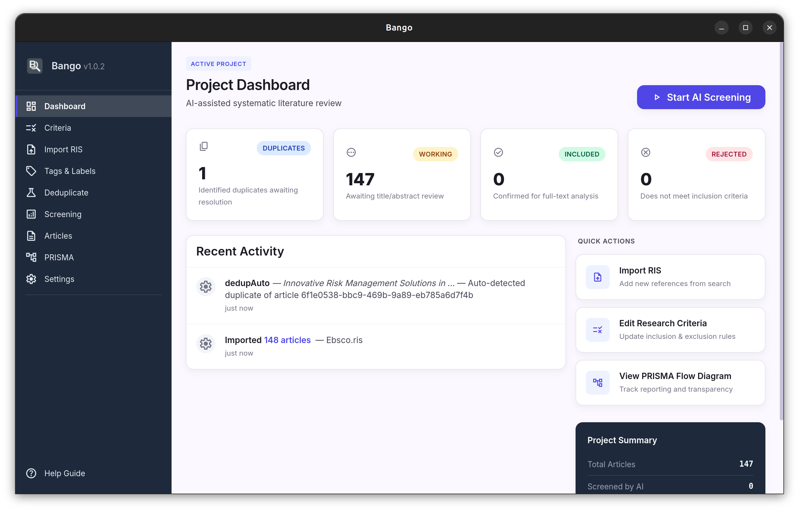
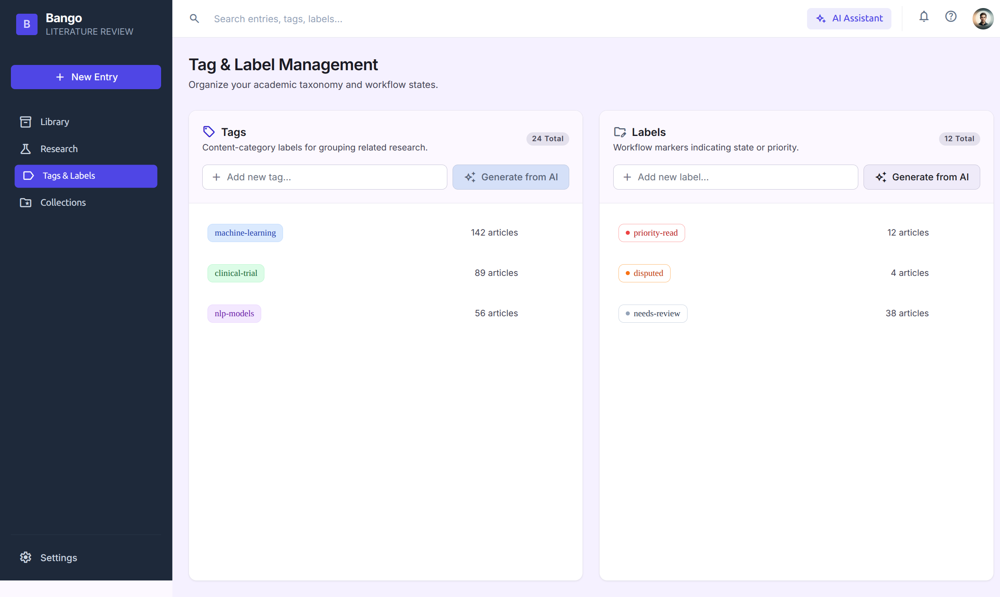
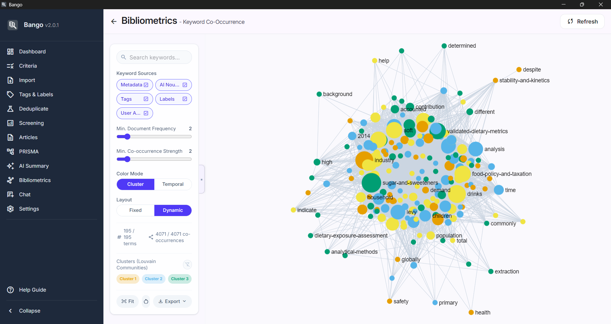
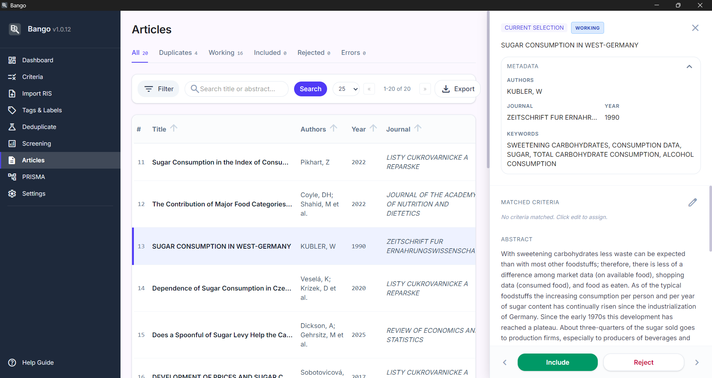

<div align="center">


# Bango

**Your Literature Review Assistant**
<br>AI-accelerated systematic literature review screening with bibliometric analysis, multilingual translation, and a local knowledge wiki

[](https://github.com/Bilal-S/Bango/releases)
[](LICENSE)
[](https://tauri.app/)
[]()

Bango is a desktop application that automates and accelerates the screening phase of systematic literature reviews, scoping reviews, and meta-analyses.
Researchers import RIS or BibTeX bibliography files, define inclusion/exclusion criteria, and let AI screen abstracts, producing a rigorously categorized set of articles ready for full-text review.
Beyond screening, Bango includes a full bibliometric analysis suite, a multilingual translation pipeline, and an LLM-powered knowledge wiki that turns your included corpus into an interconnected Obsidian-style knowledge base.

All data stays on your machine · No cloud dependency, no login, no accounts needed.

Download Info: **[macOS](#macos), [Linux](#linux), [Windows](#windows)**

</div>

**Author:** [Bilal Soylu (BonCode)](https://github.com/Bilal-S)

It took some time and help of a multitude of AIs, manual reviews, manual and automated testing to make this tool.
If you see any issues please post on GitHub issues for this project.
If you want to contribute feel free to submit a PR.
Responses will be on an availability basis (takes some time).

---

## ✨ Highlights

| | Feature | |
|---|---|---|
| 📥 | **RIS & BibTeX Import** | Multi-file import, 30+ metadata fields, 10,000 article capacity guard, valid RIS export with AI annotations |
| 🔍 | **Intelligent Deduplication** | DOI, title, year, author matching with Levenshtein similarity and manual review |
| 🤖 | **AI-Powered Screening** | Batch abstract evaluation against your criteria via hosted or local LLMs, plus Enhanced and Two-stage full-text-aware modes |
| 🌐 | **Multilingual Translation** | Auto-translate non-English articles to English before AI workflows (10-language section classification) |
| 🏷️ | **Tags & Labels** | AI-suggested content tags and workflow labels with curated standard taxonomy, backend sanitizer, and inline editing |
| 📊 | **PRISMA 2020 Diagrams** | Auto-generated four-phase flow diagrams with exclusion reason breakdowns |
| 📈 | **Bibliometric Analysis** | Six modules: co-authorship, citation, keywords, timeline, author productivity, co-citation |
| 🔗 | **References & Citations** | Track backward references and forward citations with promotion workflow |
| 📎 | **Full-Text Attachments** | Attach PDFs/TXT files, extract text (with CJK mojibake recovery), inline PDF reader, AI figure/table descriptions |
| 📚 | **LLM Wiki Knowledge Base** | Obsidian-style Markdown wiki with concept hubs, author pages, methods hubs, FTS5 search, graph visualization, and static-site export. Can be opened in Obsidian for edits and enrichments. |
| 💬 | **Chat Assistant** | RAG-based Q&A over your articles or your wiki, with source-citation badges |
| 🔎 | **Search Strategy Builder** | Generate Boolean search strings for 8 academic databases from your aims and criteria |
| ⚙️ | **Batch Import Processor** | 4-phase pipeline: full-text attach, citation import, translation, and AI summaries by DOI-keyed file matching |
| 📝 | **Research Gap Analysis** | Corpus-wide gap report covering thematic coverage, identified gaps, methodological landscape, and future directions |
| 🔒 | **Offline & Private** | Local SQLite database, AES-256-GCM encrypted API keys, no cloud upload |
| 📝 | **Audit Trail** | Every state change, tag edit, and AI decision logged with timestamp |

> **Note:** Bango is desktop-only application.

---

## 📸 Screenshots

<table>
  <tr>
    <td></td>
    <td></td>
  </tr>
  <tr>
    <td align="center"><em>Dashboard</em></td>
    <td align="center"><em>Tags and Labels</em></td>
  </tr>
  <tr>
    <td></td>
    <td></td>
  </tr>
  <tr>
    <td align="center"><em>Keyword Co-Occurrence Network</em></td>
    <td align="center"><em>Article Review</em></td>
  </tr>
</table>


---

## 📋 Table of Contents
- [Download and Installation](#download-and-installation)
- [Workflow](#workflow)
- [Key Features](#key-features)
- [Tech Stack](#tech-stack)
- [AI Integration](#ai-integration)
- [Platform-Specific Install Instructions](#platform-specific-install-instructions)
- [Getting Started](#getting-started)
- [Testing](#testing)
- [Project Structure](#project-structure)
- [Contributing](#contributing)
- [Design System](#design-system)
- [License](#license)

---

## 📥 Download and Installation

Pre-built installers for all major platforms are available on the [GitHub Releases](https://github.com/Bilal-S/Bango/releases) page.
Download the file that matches your operating system and architecture.

### Available Builds

#### Linux

| File | Best For |
|------|----------|
| [`Bango_3.0.4_amd64.AppImage`](https://github.com/Bilal-S/Bango/releases/download/v3.0.4/Bango_3.0.4_amd64.AppImage) | **Recommended.** Portable; no installation required. Works on any modern Linux distribution. |
| [`Bango_3.0.4_amd64.deb`](https://github.com/Bilal-S/Bango/releases/download/v3.0.4/Bango_3.0.4_amd64.deb) | Debian, Ubuntu, and derivatives. Installs via the system package manager. |

#### Windows

| File | Best For |
|------|----------|
| [`Microsoft Store`](https://apps.microsoft.com/detail/9np2bhgxt8h3) | **Recommended.**  Microsoft verified and signed installer for personal use. |
| [`Bango_3.0.4_x64-setup.exe`](https://github.com/Bilal-S/Bango/releases/download/v3.0.4/Bango_3.0.4_x64-setup.exe) | Standard installer with a setup wizard. Installs to Program Files and creates Start Menu entries. You will be asked to grant permissions during install. |
| [`Bango_3.0.4_x64_en-US.msi`](https://github.com/Bilal-S/Bango/releases/download/v3.0.4/Bango_3.0.4_x64_en-US.msi) | Enterprise or automated deployments. Windows Installer package suitable for group policy distribution. |


#### macOS

| File | Best For |
|------|----------|
| [`Bango_3.0.4_aarch64.dmg`](https://github.com/Bilal-S/Bango/releases/download/v3.0.4/Bango_3.0.4_aarch64.dmg) | **Recommended.** For Apple Silicon (M-CPU) Macs. Drag-and-drop install to Applications. You will be asked to grant permissions during install. |

> **Note:** macOS builds are for **Apple Silicon (ARM64)** only.
> Intel (x86_64) Macs are not supported.

### Signed Builds

- **Verified Builds**: Verified signed builds are available from the [Microsoft Store](https://apps.microsoft.com/detail/9np2bhgxt8h3) for Windows users.
  Use the Microsoft Store app to install.

### ⚠️ Unsigned Build Notice

Bango binaries downloaded from GitHub are **not code-signed**.
This means:

- **The application has not been verified by 3rd party**; you will see security warnings on first launch.
- **The binaries are safe to run**: they are built from the open-source code in this repository via [GitHub Actions CI](.github/workflows/release.yml).
  You can verify this by examining the workflow and building from source yourself.
- **We do not hold an Apple certificate**, which is required for signed distribution, but the software is still fully functional.

If you prefer not to bypass OS security prompts, you can [build from source](#getting-started) yourself instead.

---

## 🔄 Workflow

Articles flow through a strict state machine.
An article exists in exactly one state at any time:

```
Import -> Working (non-duplicate) or Duplicate (flagged)
  Duplicate -> (resolve) -> Working
  Working -> (AI screening or manual) -> Included | Rejected
```

| State | Description | Editable |
|-------|-------------|----------|
| **Duplicate** | Flagged as duplicates during import. Read-only until resolved via side-by-side review. | No (until resolved) |
| **Working** | Deduplicated articles awaiting screening. Non-duplicates arrive here directly on import. | Yes |
| **Included** | Articles meeting inclusion criteria. | Yes |
| **Rejected** | Articles excluded based on criteria. | Yes |

On import, deduplication runs against all existing articles.
Non-duplicates are promoted directly to Working.
If a newly imported article duplicates one already in Working, Included, or Rejected, the existing article's status is never changed; the new article is placed in Duplicates referencing the accepted article.

Users can manually override AI decisions and move articles freely between Working, Included, and Rejected.

> **Translation:** When auto-translate is enabled, non-English articles are permanently translated to English before AI screening and summary workflows consume them.
> See the Multilingual Translation section under Key Features below for details.

> **Enhanced Screening:** In addition to the default abstract-only mode, two full-text-aware screening modes (Enhanced and Two-stage) can leverage attached PDF text for higher-accuracy screening.
> See the AI-Powered Abstract Screening section under Key Features below for details.

---

## 📦 Key Features

<details>
<summary><strong>📥 Data Import and Export</strong></summary>

- Import **RIS** and **BibTeX** bibliography files with full metadata (title, abstract, authors, year, DOI, journal, keywords, and more)
- Import multiple files into a single project with automatic re-deduplication
- **Capacity guard**: enforces a 10,000 article project limit; imports that would exceed this are blocked
- Preview parsed records and manually deselect individual articles before confirming import
- Export the included list in valid RIS format, with AI-generated tags (`KW`), reasoning notes (`N1`), user notes (`NO`), and inclusion/exclusion labels (`C1` as JSON)
- Full project export/import as a single `.bango.json` file (API keys excluded; bibliometrics, wiki content, and AI summaries are regenerable and excluded)

</details>

<details>
<summary><strong>🔍 Intelligent Deduplication</strong></summary>

- Multi-strategy matching: DOI exact match, title+year exact (>=95% similarity), fuzzy title+year (70 to 94%), author+title partial
- Levenshtein distance-based title comparison with normalization
- Auto-merge exact duplicates; flag fuzzy matches for side-by-side manual review
- Non-duplicate articles are promoted directly to the Working list on import
- Duplicates are placed in a separate Duplicates list with `duplicateOf` references
- Cross-status dedup protection: articles already in Working, Included, or Rejected are never affected by new duplicate imports

</details>

<details>
<summary><strong>📋 Criteria-Based Screening</strong></summary>

- Define research aims as a list of discrete text entries
- Define inclusion and exclusion criteria as discrete entries, each with a priority level
- Priority levels: **Critical**, **High**, **Standard**, **Low**, or **Optional**
- Deterministic conflict resolution: highest-priority matched rule wins; ties favor inclusion; no match defaults to exclude
- **Inline editing**: double-click any aim or criterion text to edit it in place
  (`Enter` saves, `Shift+Enter` for newline, `Esc` cancels, empty commit deletes)
- **Custom screening rules** (Section 4 in the Criteria editor): free-text combinatorial rules (AND/OR gates, hard exclusions, conditional inclusion) that are injected into every screening prompt
  - References criteria by their global number so "criterion 3" is unambiguous to the LLM, the user, and the reasoning

</details>

<details>
<summary><strong>🤖 AI-Powered Abstract Screening</strong></summary>

- Configure connections to hosted LLMs (OpenAI, Anthropic, Google, Mistral AI, z.ai) or local setups (llama.cpp, Ollama, LM Studio), plus any OpenAI-compatible endpoint
- AI evaluates article abstracts in **batches** (1 to 5 articles per call) for high throughput
- Returns structured JSON with decision, reasoning paragraph, matched criteria, suggested tags, extracted terms, and confidence score
- Background batch processing with configurable concurrency (default: 3) and request delay (default: 500ms)
- Exponential backoff on rate limits; malformed responses flagged as screening errors
- Optional `max_articles` cap to process a bounded subset in a single run

**Three screening modes** (selectable in Settings):

| Mode | Behavior | Token Cost |
|------|----------|------------|
| **Abstract** (default) | Screens on the abstract alone | ~63 tokens/article |
| **Enhanced** | Screens abstract + top-K criteria-matched chunks from Methods/Results sections | ~320 tokens/article |
| **Two-stage** | Stage 1: abstract screening; borderline articles (confidence in `[0.4, 0.7)`) get a second full-text-aware pass | ~63 clear-cut, ~320 borderline |

- Enhanced and Two-stage modes apply per-article only when full text is attached; articles without full text fall back to abstract-only screening
- A per-article chunk budget (default 2400 words) prevents any single article from blowing the context window
- At screening start, previously-attached PDFs without chunks are backfilled transparently (no LLM call)

</details>

<details>
<summary><strong>🌐 Multilingual Translation</strong></summary>

Non-English articles can be translated to English before AI workflows consume them.
This is a **Plan-A permanent rewrite**: the working article row and chunks hold English text after translation, while originals are preserved in a separate archive.

- **Auto-translate** (Settings toggle, default off): non-English articles are automatically enqueued for translation during import and screening
- **Manual translate** button on the article detail header for any non-English article (works regardless of auto-translate setting)
- **Two job kinds** (selected automatically):
  - `MetadataOnly`: translates title + abstract (for articles without full text)
  - `FullText`: translates title + abstract + full text + chunks, then re-chunks the English result
- **10-language section classification**: Academic section headings (Abstract, Introduction, Methods, Results, Discussion, Conclusion, References) are recognized in French, Spanish, Japanese, Chinese, German, Russian, Portuguese, Italian, Arabic, and Turkish
- **Queue worker**: a dedicated background worker with its own SQLite connection processes translation jobs sequentially without blocking UI command handlers
- **Crash recovery**: on app startup, stranded jobs from a crashed session are marked `failed`; the user selectively retranslates via the manual button
- **TRANSLATED badge** appears on the article detail header once translation is complete
- Originals preserved in `article_original_content` + `article_original_chunks` tables

</details>

<details>
<summary><strong>🏷️ Tag and Label Management</strong></summary>

- **Tags**: content-category labels (e.g., "machine-learning", "clinical-trial")
  AI suggests from RIS keywords and user criteria; user can add, edit, delete
- **Labels**: workflow markers (e.g., "priority-read", "disputed")
  AI generates from inclusion/exclusion criteria; user can expand and modify
- **Standard taxonomy surfacing**: the standalone `suggest_tags` command injects 20 curated study-type tags (`systematic-review`, `meta-analysis`, `rct`, `cohort-study`, etc.) and `suggest_labels` injects 12 workflow-state labels (`priority-read`, `strong-methodology`, `borderline`, etc.)
- **Backend sanitizer**: all tag/label names are sanitized to <=35 chars, lowercase, hyphenated; `inclusion:`/`exclusion:` prefixes are stripped; truncation happens at the last word boundary (never mid-word)
- **Inline editing**: double-click any tag/label chip to edit it in place (`blur` saves, `Esc` cancels)
- Tags and labels generated in a pre-screening pass; user reviews before AI screening begins
- Full manual editing: override any AI decision, adjust tags and labels, move articles between lists

</details>

<details>
<summary><strong>📈 Bibliometric Analysis (6 Modules)</strong></summary>

All modules operate on your **included articles** and imported citation/reference data.
A single **Normalize** transaction builds the analytical data layer; modules then become available from the Bibliometrics dashboard.

1. **Co-Authorship Network** - Maps collaborative relationships between researchers.
   Full and fractional edge counting, Louvain community detection, ForceAtlas2 layout.
   Export as PNG or GEXF.
2. **Citation Network** - Directed graph showing which articles cite which others, with main-path analysis (Search Path Count).
   Trace ancestry or progeny of any node.
   Unmatched references appear as dashed leaf nodes.
3. **Keyword Co-Occurrence** - Discover thematic clusters from five combinable sources: metadata keywords, AI noun phrases, tags, labels, and user-added terms.
4. **Publication Timeline** - Stacked bar charts of publications, references, and citations by year, plus a growth-rate sparkline.
   CSV and SVG export.
5. **Author Productivity Ranking** - Sortable table with h-index, i10-index, g-index, plus first/last/solo author counts.
   Google Scholar lookup icons.
   Detail slide-over with per-article breakdown.
6. **Co-Citation Analysis** - On-demand computation with four normalization modes (Raw, Cosine, Jaccard, Pearson).
   Dual visualization: interactive network graph and sortable heatmap.
   Scope: included or all articles.

</details>

<details>
<summary><strong>🔗 References and Citations Tracking</strong></summary>

- Track **backward references** (articles cited by a paper) and **forward citations** (articles that cite a paper)
- Import reference/citation detail via RIS or BibTeX for any article
- **N1 citation count extraction**: automatically parses `Total Times Cited` and `Cited Reference Count` from Web of Science notes during standard imports
- **Promotion workflow**: unmatched reference papers with abstracts can be promoted to full articles in the Working list
- **Match status** states: `unmatched`, `matched` (linked to existing library article), `imported`, `not_in_library`
- **Citation Chaser integration**: external tool output can be imported by placing DOI-keyed RIS files in the `{storage_root}/ris/` directory and running the Batch Import Processor

</details>

<details>
<summary><strong>📊 PRISMA 2020 Flow Diagram</strong></summary>

- Standard four-phase PRISMA 2020 flow diagram with exact record counts
- Optional exclusion reason breakdown (user-controlled toggle)
- Rendered as SVG; exportable as SVG and PNG

</details>

<details>
<summary><strong>📎 Full-Text Attachments</strong></summary>

- Attach `.pdf` or `.txt` files to any article
- **Text extraction**: PDF text parsed and cached in the `full_text` field; TXT read as plain text
- **CJK PDF mojibake recovery**: when a CJK PDF font lacks a ToUnicode CMap, the extractor detects the common Latin-1 misinterpretation and re-decodes the bytes to correct Unicode (Shift-JIS, EUC-JP, CP949, GB18030)
- **Section-aware chunking**: extracted text is classified into sections (Methods, Results, Discussion, etc.) and chunked for semantic retrieval, table/figure caption extraction, and screening evidence
- Original file copied to a configurable storage root (defaults to `~/Documents/Bango/fulltext/`)
- **Inline PDF reader**: render attached PDFs directly inside the article detail panel
- **AI Summary (schema v2 superset)**: the `generate_article_ai_summary` command can produce section-typed facts (`study_design`, `sample_size` for Methods; `effect_size`, `confidence_interval` for Results) when section summaries are enabled
- **Figure/Table descriptions**: `generate_figure_descriptions` extracts figure/table captions from the full text and sends them in one batched LLM call to produce grounded descriptions, rendered as grids/blocks in the summary view

</details>

<details>
<summary><strong>📚 LLM Wiki Knowledge Base</strong></summary>

Bango generates and maintains a local-first Obsidian-style Markdown knowledge base from your included article corpus.
The wiki lives on disk under `{storage_root}/wiki-root/` and is fully navigable inside the app.

**Page types:**

- **Author pages**: metrics (h-index, citations, papers/year), publications list with footnotes, research areas, frequent collaborators
- **Synthesis pages**: one per included article with an AI summary, digest, key insights, and concept links
- **Concept hubs**: top terms from the corpus linking to their articles and co-occurring concepts
- **Methods hubs**: study-design hubs (RCT, cohort, meta-analysis, etc.) with a curated lexicon for canonicalization
- **Source pages**: one per user-uploaded external document (PDF/TXT/web) for first-class wiki node integration

**Features:**

- **Deterministic 5-layer pre-seed matrix**: author, synthesis, concept, methods, and source pages are generated deterministically before the LLM runs, so the wiki backbone exists regardless of which model is used
- **Parallel chunked ingest**: large corpora are split into batches and processed concurrently for faster generation
- **Multi-batch consolidation**: cross-batch duplicate pages are merged deterministically with link rewriting
- **FTS5 BM25 search**: full-text search index over all wiki pages
- **Graph visualization**: sigma + ForceAtlas2 layout, color-coded by page type, with hover tooltips
- **RAG chat**: token-budgeted chat over the wiki FTS5 index with section-aware citations
- **External-edit drift detection**: detects when external programs (e.g., Obsidian) edit wiki files and re-indexes transparently without re-running the LLM
- **Static-site export**: exports the wiki as a self-contained static website (HTML + CSS + JS + Markdown) in a `.zip` file; article references resolve to synthesis pages or metadata-only stubs (copyright-safe, no full text included)
- **Back/Forward navigation**: browser-style page navigation with platform-aware keyboard shortcuts (`Alt+Left`/`Alt+Right` on Windows/Linux, `Cmd+[`/`Cmd+]` on macOS)

</details>

<details>
<summary><strong>💬 Chat Assistant (RAG)</strong></summary>

- Conversational interface to query your systematic review project
- **Two retrieval modes** (mutually exclusive):
  - **Article RAG**: Retrieval-Augmented Generation over your criteria, research aims, and article abstracts
  - **Wiki RAG**: BM25 FTS5 search over the LLM Wiki knowledge base, with section-aware citations
- Answers include source-citation badges linking directly to referenced articles or wiki pages
- Wiki-sourced assistant bubbles render with `[[wikilink]]` and `[^art-id]` resolution
- A Wiki toggle button in the chat view switches between modes (visible only when the wiki is initialized with pages)

</details>

<details>
<summary><strong>🔎 Search Strategy Builder</strong></summary>

Generates database-ready Boolean search strings for 8 academic databases from the research aims and inclusion/exclusion criteria you have already defined in the Criteria view.
**Copy-only** - it builds text strings you paste into each database's own search interface.

- **Supported databases**: PubMed, Scopus, Web of Science, Cochrane Library, EBSCOhost, JSTOR, ScienceDirect, arXiv
- **PICO breakdown**: concept blocks with 3-8 synonyms each
- **Per-database syntax**: the system prompt embeds a full cheatsheet (operators, field codes, format conventions) so the LLM produces syntactically correct strings per platform
- **Warnings**: surfaces concerns like missing concepts or the Semantic Scholar non-Boolean advisory
- Surfaced inline as a collapsible card in the Criteria editor, gated on having aims and LLM configured

</details>

<details>
<summary><strong>⚙️ Batch Import Processor</strong></summary>

Scans the Bango Documents directory for files produced by external tools and imports them by DOI-keyed file matching.
Runs as a background task with live progress and cancel support.

**4-phase pipeline:**

1. **Full Text** (Phase 1): scans `fulltext/` for `{doi}.pdf` / `.txt` files and attaches them to matching articles
2. **Citations** (Phase 2): scans `ris/` for `{doi}_references.ris`, `_citations.ris`, `.ris`, `.bib` files and imports references/citations
3. **Translations** (Phase 3): enqueues `FullText` translation jobs for non-English newly-attached articles (only when auto-translate is enabled)
4. **AI Summaries** (Phase 4): generates AI summaries for newly-attached articles without an existing summary (only when LLM is configured)

Each phase skips articles that already have the relevant data, making the pipeline idempotent.

</details>

<details>
<summary><strong>📝 AI Summary and Research Gap Analysis</strong></summary>

- Generates a structured AI summary of included articles: key themes, research trends, methodological strengths, common weaknesses, and literature gaps
- **Section-aware summaries** (schema v2): when section summaries are enabled, the LLM returns section-typed facts (`study_design`, `sample_size`, `effect_size`, `confidence_interval`) for Methods/Results/Discussion
- **Figure/Table descriptions**: extracts figure/table captions and generates grounded descriptions in one batched LLM call per article
- **Evidence enrichment**: optional `summary_evidence_mode` setting (`abstract_only` or `with_summary_facts`) enriches the literature review prompt with AI summary facts

**Research Gap Analysis:**

- A "Research Gap Report" button generates a corpus-wide Markdown gap-analysis report covering five sections: Thematic Coverage, Identified Gaps, Methodological Landscape, Future Research Directions, and References
- Shares the same toolbar, gating, and export buttons (Citation Style, Copy, Export Markdown, Export PDF) as the literature review
- Mirrors the batching strategy (split + synthesize) when the corpus exceeds 80% of the context window
- Persisted in a single-row table; cleared on project restore

</details>

<details>
<summary><strong>📝 Audit Trail and Search</strong></summary>

- Every state change, tag/label edit, and AI decision logged with timestamp and source
- **Audit entry coalescing**: rapid same-type edits within a 5-minute window update the existing entry instead of spamming duplicates
- Per-article history timeline view
- System-wide errors (scraping, LLM config) logged to the Diagnostics screen
- Full-text search across title and abstract fields
- Sort by title, publication year, date added, or AI confidence score
- Filter by status, tags, labels, matched criteria, publication year range, and manual override status

</details>

---

## 🛠️ Tech Stack

| Layer | Technology |
|-------|------------|
| **Framework** | [Tauri 2.x](https://tauri.app/) - lightweight cross-platform runtime |
| **Frontend** | [Vue 3](https://vuejs.org/) + TypeScript |
| **Styling** | [Tailwind CSS v4](https://tailwindcss.com/) (`@theme` design tokens) + CSS custom properties |
| **Backend** | [Rust](https://www.rust-lang.org/) - memory-safe, non-blocking background processing |
| **Database** | Local [SQLite](https://www.sqlite.org/) - portable, offline-first (WAL mode, FTS5 full-text search) |
| **Graph rendering** | [Sigma.js](https://www.sigmajs.org/) + [Graphology](https://graphology.github.io/) |
| **Graph layout** | [ForceAtlas2](https://github.com/graphology/graphology-layout-forceatlas2) |
| **Community detection** | [Louvain](https://github.com/graphology/graphology-communities-louvain) |
| **Charts** | [ApexCharts](https://apexcharts.com/) (vue3-apexcharts) |
| **Markdown** | [marked](https://marked.js.org/) |
| **PDF text extraction** | `unpdf` + `lopdf` (with `encoding_rs` + `chardetng` for CJK mojibake recovery) |
| **Zip packaging** | [`zip`](https://crates.io/crates/zip) (wiki static-site export) |
| **AI** | REST API client in Rust - async requests to external or local LLM endpoints |
| **Encryption** | AES-256-GCM with PBKDF2 key derivation |

---

## 🤖 AI Integration

Bango supports a range of LLM providers to fit different budgets and privacy requirements.

All providers use a **user-provided full base URL**; the app appends paths.
Unless otherwise specified, this has to be OpenAI compatible.
API keys are encrypted locally with AES-256-GCM using a machine-derived key.
Project exports do not include keys; collaborators must provide their own.

**Hosted Providers:** OpenAI · Anthropic · Google (Gemini) · Mistral AI · z.ai

**Local Providers:** llama.cpp · Ollama · LM Studio

**Custom:** Any OpenAI-compatible endpoint

> The system recommends an LLM with a context window of **50,000 tokens or larger**.
> A warning is displayed if a local provider is selected.

**LLM-powered features:**

| Feature | LLM Request Type | Description |
|---------|-----------------|-------------|
| AI Screening | `Screening` / `EnhancedScreening` | Abstract evaluation against criteria (batched), with optional full-text chunk evidence |
| AI Summary | `Summary` | Section-aware literature review with optional figure/table descriptions |
| Research Gap Analysis | `GapAnalysis` | Corpus-wide gap report |
| Wiki Ingest | `WikiIngest` | Parallel chunked generation of wiki pages |
| Wiki Chat | (direct) | BM25 FTS5 retrieval + LLM generation |
| Translation | (direct) | Title/abstract/full-text translation to English |
| Tag/Label Suggestions | (direct) | Standard taxonomy surfacing |
| Search Strategy Builder | `SearchStrategy` | Boolean search strings for 8 databases |
| Figure/Table Descriptions | `FigureDescription` | Grounded caption descriptions |
| Criteria Consistency Check | (direct) | LLM review of criteria and custom rules |

All LLM calls go through a centralized **LlmOrchestrator** that enforces concurrency limits, request delays, rate-limit backoff, and diagnostic logging.


## Platform-Specific Install Instructions

<details>
<summary><strong>🐧 Linux</strong></summary>

**AppImage (recommended):**
This is a full self-contained package.

```bash
chmod +x Bango_*_amd64.AppImage
./Bango_*_amd64.AppImage
```

> If AppImage won't launch, ensure FUSE is installed: `sudo apt install libfuse2` (Debian/Ubuntu) or the equivalent for your distribution.

**DEB package:**

```bash
sudo apt install ./Bango_*_amd64.deb
```
or

```bash
sudo dpkg -i Bango_*_amd64.deb
sudo apt-get install -f   # resolve any missing dependencies
```

Linux does not enforce code signing, so no additional security bypass steps are needed.

</details>

<details>
<summary><strong>🪟 Windows</strong></summary>

1. Download [`Bango_3.0.4_x64-setup.exe`](https://github.com/Bilal-S/Bango/releases/download/v3.0.4/Bango_3.0.4_x64-setup.exe) (or the [`.msi`](https://github.com/Bilal-S/Bango/releases/download/v3.0.4/Bango_3.0.4_x64_en-US.msi) for enterprise installs).
2. Double-click to run the installer.
3. **Windows SmartScreen** will show a warning: *"Windows protected your PC"*
   - Click **"More info"**
   - Click **"Run anyway"**
4. Follow the setup wizard to complete installation.

If your organization blocks unsigned installers via Group Policy, use the MSI package or build from source.

</details>

<details>
<summary><strong>🍎 macOS</strong></summary>

1. Download [`Bango_3.0.4_aarch64.dmg`](https://github.com/Bilal-S/Bango/releases/download/v3.0.4/Bango_3.0.4_aarch64.dmg).
2. Double-click the `.dmg` file to open it.
3. Drag **Bango** to the **Applications** folder.
4. On first launch, **macOS Gatekeeper** will block the app: *"Bango cannot be opened because the developer cannot be verified."*

**To bypass Gatekeeper:**

- **Option A:** Right-click (or Control-click) the app, select **"Open"**, then click **"Open"** again in the confirmation dialog.
- **Option B:** Run the following command in Terminal:

```bash
xattr -cr /Applications/Bango.app
```

After bypassing once, the app will launch normally on subsequent opens.

</details>

### Build from Source

If you prefer to build Bango yourself, or need to run on an architecture without pre-built binaries, follow the instructions in [Getting Started](#getting-started) below.

> **RPM:** RPM packages are not published by CI.
> To produce one, run `npm run tauri build -- --bundles rpm` on a Linux host (requires `rpm`/`rpmbuild`).
> Add `rpm` to `bundle.targets` in [`src-tauri/tauri.conf.json`](src-tauri/tauri.conf.json) to make it the default.

---

## 🚀 Getting Started

### Prerequisites

| Tool | Version | Install |
|------|---------|---------|
| **Node.js** | 22+ | [nodejs.org](https://nodejs.org/) |
| **Rust** | Latest stable | [rustup.rs](https://rustup.rs/) |
| **Tauri CLI** | v2.x | Included via `@tauri-apps/cli` in devDependencies |

### Install dependencies

```bash
npm install
```

This also runs `simple-git-hooks` to set up pre-commit linting.

### Development (frontend only)

Starts the Vite dev server on `http://localhost:1420`:

```bash
npm run dev
```

> **Note:** Tauri commands (`invoke`) will not work in browser-only mode.
> Use the Tauri dev command for full functionality.

### Development (full Tauri app)

Starts the Vite dev server + Rust backend in a native window:

```bash
npm run tauri dev
```

### Build for production

Compiles TypeScript, builds the Vite frontend, and bundles the Tauri app:

```bash
npm run tauri build
```

---

## 🧪 Testing

### Frontend tests (Vitest)

```bash
npm test            # Run once
npm run test:watch  # Watch mode
```

### Backend tests (Rust)

```bash
cd src-tauri && cargo test
```

### Run all checks

Runs type-check, ESLint, Prettier, Rust formatting, Clippy, and the Vitest suite:

```bash
npm run check:all
```

| Command | What it does |
|---------|-------------|
| `npm run lint:check` | ESLint on `.ts` and `.vue` files |
| `npm run format:check` | Prettier formatting check |
| `npm run lint:rust` | Cargo clippy with `-D warnings` |
| `npm run format:rust` | Cargo `fmt --check` |

### Coverage

Coverage is opt-in and not part of `npm run check:all`.
The target is **70% line coverage** for both Rust and Vue/TS.
We are currently running below this.
You can contribute via PR.

| Stack | Command | Report Location |
|-------|---------|-----------------|
| **Vue/TS** | `npm run test:coverage` | `coverage/index.html` |
| **Rust** | `cd src-tauri && cargo llvm-cov --html --output-dir target/llvm-cov/html` | `src-tauri/target/llvm-cov/html/html/index.html` |

> Requires `cargo-llvm-cov` and the `llvm-tools-preview` rustup component for Rust coverage.
> Both artifact directories are git-ignored.
> See [`docs/test-coverage-report.md`](docs/test-coverage-report.md) for the current baseline and highest-value coverage gaps.

---

## 📁 Project Structure

```
├── src/                        # Vue 3 frontend
│   ├── components/             # Reusable Vue components
│   │   ├── help/               # Help-guide tab components (5 tabs)
│   │   ├── settings/           # Settings sub-components
│   │   └── wiki/               # Wiki viewer, editor, graph, toolbar
│   ├── composables/            # Vue composables (shared reactive logic)
│   ├── stores/                 # Pinia stores for global state
│   ├── views/                  # Page-level components (one per route)
│   ├── types/                  # TypeScript interfaces
│   ├── utils/                  # Pure utility functions
│   │                           #   (wiki-markdown, wiki-site-export, platform, etc.)
│   ├── workers/                # Web Workers (layout, main-path)
│   ├── styles/                 # CSS: base.css, tokens.css, forms.css
│   └── main.ts                 # App entry point
├── src-tauri/                  # Rust backend
│   ├── src/
│   │   ├── commands/           # Tauri command handlers
│   │   ├── db/                 # SQLite repos, migrations, connection
│   │   │   ├── biblio_repo/    # Bibliometric repos (kpis, networks, authors...)
│   │   │   └── migrations/     # Schema migrations (v001-v005)
│   │   ├── models/             # Domain models (Article, Tag, Label, etc.)
│   │   ├── ris/                # RIS parser, validator, types
│   │   ├── bibtex/             # BibTeX parser
│   │   ├── screening/          # AI screening engine, prompt builder, chunk retrieval
│   │   ├── translation/        # Multilingual translation pipeline + queue worker
│   │   ├── dedup/              # Deduplication engine, similarity scoring
│   │   ├── biblio/             # Bibliometric normalization + affiliation extraction
│   │   ├── export/             # RIS writer, project backup, legacy converter
│   │   ├── llm/                # LLM HTTP client + orchestrator
│   │   ├── summary/            # AI summary + research gap analysis
│   │   ├── wiki/               # LLM Wiki knowledge base (ingest, FTS5, chat, graph)
│   │   │   └── ingest/         # Parallel chunked ingest pipeline
│   │   ├── batch_import/       # 4-phase batch import processor
│   │   ├── prisma/             # PRISMA diagram data + SVG generation
│   │   ├── scraping/           # Web scraping utilities + Citation Chaser
│   │   ├── crypto/             # AES-256-GCM encryption for API keys
│   │   └── utils/              # Shared Rust utilities (sections, chunking, pdf_extract)
│   ├── resources/              # Bundled journal_index.db
│   └── tests/                  # Rust integration tests
├── scripts/
│   ├── enrich_demo.py          # Demo project generator
│   ├── import_journals/        # Journal Index CSV import binary
│   └── sync-version.sh         # Version sync helper
├── tests/                      # RIS fixture data for system tests
├── docs/
│   ├── bango-v4-spec.md        # v4 product specification (authoritative)
│   ├── CLAUDE.md               # Coding rules and conventions
│   ├── test-coverage-report.md # Coverage baseline + gap analysis
│   └── test-plans/             # Binding test inventory files
├── landingpage/                # Standalone marketing microsite (not shipped)
├── design/                     # Logo and design assets
└── DESIGN.md                   # Scholarly Precision design system tokens
```

---

## 🤝 Contributing

Contributions are welcome.
To get started:

1. **Fork** the repository and create a feature branch:
   ```bash
   git checkout -b feat/my-feature
   ```
2. **Make your changes** following the coding rules in [`docs/CLAUDE.md`](docs/CLAUDE.md):
   - Rust: no `unwrap()`/`expect()` outside tests, `anyhow`/`thiserror` error types, `snake_case` files
   - TypeScript/Vue: `<script setup lang="ts">`, strict mode, no `any`, `kebab-case` files
3. **Add or update tests** in the same change so coverage does not regress.
4. **Run all checks** before committing:
   ```bash
   npm run check:all
   cd src-tauri && cargo test
   ```
5. **Commit** using [Conventional Commits](https://www.conventionalcommits.org/) format:
   ```
   type(scope): description
   ```
6. **Open a Pull Request** describing your changes.

Pre-commit hooks (via `simple-git-hooks` + `lint-staged`) automatically run ESLint and Prettier on staged files.

---

## 🎨 Design System

The UI follows the **Scholarly Precision** design system defined in [`DESIGN.md`](DESIGN.md).

- **Colors**: Material Design 3 inspired palette (Indigo primary, Slate sidebar, cool gray surfaces)
- **Typography**: Inter font family, sizes from 11px (label-caps) to 24px (display)
- **Icons**: Material Symbols Outlined via Google Fonts
- **CSS approach**: Tailwind CSS v4 (`@theme` tokens) + CSS custom properties (`tokens.css`).
  Tailwind preflight is disabled to support views using scoped CSS.

---

## 📄 License

This project is licensed under the [Apache License 2.0](https://www.apache.org/licenses/LICENSE-2.0).

```text
Copyright 2025-2026 BonCode (Bilal Soylu)

Licensed under the Apache License, Version 2.0 (the "License");
you may not use this file except in compliance with the License.
You may obtain a copy of the License at

    http://www.apache.org/licenses/LICENSE-2.0

Unless required by applicable law or agreed to in writing, software
distributed under the License is distributed on an "AS IS" BASIS,
WITHOUT WARRANTIES OR CONDITIONS OF ANY KIND, either express or implied.
See the License for the specific language governing permissions and
limitations under the License.
```

---

<div align="center">

**[⬆ Back to Top](#bango)**

</div>